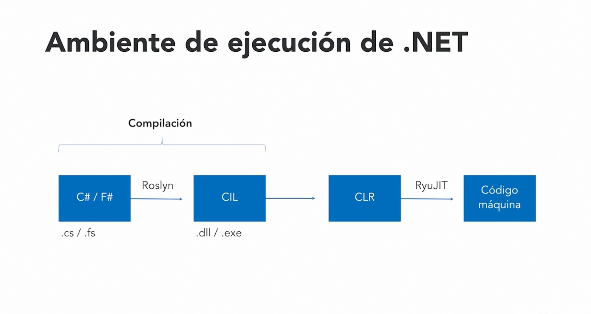

# Notes made to understand and document .NET info

## What is .NET?
Multiplatform environment for software development, including:
* Desktop apps
* Web apps
* Web services
* OS services
* Games
* IoT Apps

## What is .NET 5?
Homogenous, unified and multi platform development environment

## .NET runtimes as of .NET 5
* .NET Framework (Windows apps)
* Unity (Games)
* .NET Compact Framework (Phone apps)
* Silverlight (Web)
* .NET Core
* Mono/Xamarin

## .NET Characterics
* Open-source
* Multi platform
* Free to use
* New version every year

## Why use .NET instead of .NET Framework
.NET Framework **won't have new functionality** only bug fixes.

## Relation between .NET Standard & .NET 5
.NET Standard has only a selection of APIs while .NET 5 is entirely multi platform, in this sense, .NET 5 englobes .NET Standard as well as every other .NET product.

## What is a TFM?
*A target framework moniker (**TFM**) is a standardized token format for specifying the target framework of a . NET app or library.*

Basically is a tag inside the project settings that changes the target platform of the app/library.

Using the *.netX.Y* TFM you are developing a multi platform software, in case of wanting to target a specific platform, you can add their respectives TFMs, like *netX.Y-android* for Android, *netX.Y-windows* for Windows and *netX.Y-ios* for IOS. The functionalities of every API are then added together.

## Supported .NET programming languages
You can use any of the following programming languages to use .NET:
* C# 9.0
* F# 5.0
* VB 16.0
Which one you use is based on your own personal preferences.

## Installation of .NET SDK
You have 2 options for downloading and installing .NET, though one of them is only used if you plan to use Visual Studio as your IDE, the 2 options are the following:
* Going to the official .NET page [dot.net](https://dot.net) and downloading it from there.
* Managing the Visual Studio modules **this option is only useful for Visual Studio users.**

## Note for using certain programs that are Linux based
Turn on *"Windows Subystem for Linux"*, *"Virtual Machine Platform"* and *"Windows Hypervisor Platform"* features inside *"Windows Features"*.

### Installing .NET inside WSL Linux

1. Get the Ubuntu version you want from *Microsoft Store*.
2. Execute the resulting .msi file.
3. Open Ubuntu inside a terminal.
4. Go to Microsoft Documentation on [*How to install .NET in Linux*](https://learn.microsoft.com/en-us/dotnet/core/install/linux-ubuntu).
5. Scroll until you find your Ubuntu version.
6. Copy and paste the *Microsoft package feed* commands corresponding to your selected Linux version and run them inside your Ubuntu terminal.
7. Do the same with the SDK install commands.

## Command Line Interface (CLI)

In order to work with .NET there is a series of commands with varying effects that are used within a terminal. To know these commands there is the official .NET documentation found [here](https://learn.microsoft.com/en-us/dotnet/core/tools/dotnet) or the use of different commands like *"dotnet help"* or commands without parameters like *"dotnet new"*, when running these commands a directory of all the useful command with their info will be displayed.

Some useful .NET commands to know when starting out are *"dotnet new"* and *"dotnet run"*. *"dotnet new"* will create a new .NET project from a range of options like *console applications, class libraries, unit tests and Windows Forms Apps* among others. On the other hand, *"dotnet run"* will run a .NET project whilst in a directory containing such project. 

### Downgrading to an old version of SDK

In order to know which version of the SDK is being used there is a file named "*global.json*", said file can be created with the *"dotnet new"* command with the version of the SDK as a parameter. If no "*global.json*" file is found, the project will assume that the last version installed will be the one being used for a project.

### Handling packages

Packages are folders with code and dll which are used to install a certain technology withing a machine. These packages can be downloaded from different sites but there is a popular one called [NuGet.org](https://www.nuget.org/) which has over 340 thousand unique packages uploaded to their site.

There are several options to add Packages to your project:

* Copying the commands found in the package site on NuGet and pasting it in your project files.
* Adding them directly from the CLI using the command *"dotnet add package"* with the corresponding package name.
* Using the *"NuGet Gallery"* withing Visual Studio Code.
* Right-clicking the project in Visual Studio and selecting the *"Manage NuGet Packages..."* option.

Docker can also be used to create several *"containers"* which are independent from each other with their respective SDKs installed, these *"containers"* can be used as separate machines to run different programs. To install packages into a Docker container you can use the commands found in [*docker hub*](https://hub.docker.com/) which are usually *"docker pull"* followed by the package identifier. It then creates an *"image"*, found with the CLI command *"docker images"* that can be then run by using the command *"docker run"*.

## Compilation model

Roslyn is the code compiler used in .NET in both C# and Visual Basic programming languages. It is developed by Microsoft and is open source.

The compiler is found inside each .NET SDK version folder and is identified with the files *"csc.dll"* for C# and *"vbc.dll"* for Visual Basic respectively.

You can execute those dlls as if they were dotnet projects and with a "*.cs"* file as a parameter, given it has all the references solved, will create an executable (*".exe"*).

The *".exe"* file is a *Common Intermediate Language* (**CIL**) that then can be run by the *Common Language Runtime* (**CLR**) available in .NET.

## .NET assemblies

There are 2 types of assemblies, executables or *".exe"* and dynamic-link library"*.dll*":

* Executables can be run and will behave accordingly to how they are programmed
* Dynamic-link libraries are used to share code.

Both DLLs and executables have intermediate language produced by the compiler that then is transformed by the CLR into machine language.

## How is code executed in .NET?

The following image describes how the code is executed, from the C# or F# scripts until the Machine Language:

The order is as follows for the C# compiler "*csc.dll*":
1. You write your program/library in either C# or F#
2. The scripts are compiled with Roslyn to create the *Common Intermediate Language* (CIL)files, either *.dll* or *.exe*.
3. When you run your program, the *Common Language Runtime* compiles Just In Time (JIT) the CIL files and transform them into Machine Language using RyuJIT.

### Clarifications about the CLR
The CLR has the following characteristics:
* JIT compilation.
* A common system of types, no matter what language you wrote the program in, the Machine Language will be the same. For instance, a "*uint*" in C# would be the same as a "*UInteger*" in Visual Basic in terms of Machine Language commands.
* An Exception Handler that will notify the user in case something goes wrong with the program.
* A Garbage Collector that will free memory periodically.

## Publishing with .NET
You can deploy .NET applications in 2 ways:

1. Framework-dependant executables
2. Self-containing executables

Which way you choose to publish your application depends on you. However they both have pros and cons.

### Framework-dependant executables

#### Advantages
* Cross-platform: If a machine has the .NET runtime installed with all the dependencies, it can run the .NET application.
* Faster deployment: As the .NET runtime isn't included in each build it is faster to deploy.

#### Disadvantages
* Requires pre-installing the .NET runtime in order to run the application.
* The .NET version on which the application is running may change according to the .NET version installed with the machine. This can lead to unexpected behaviours.

### Self-containing executables

#### Advantages
* The .NET version on which the application runs is set in stone once you deploy it.
* A specific platform is targeted when deploying the application. Testing can be done to ensure the applications runs smoothly in every target platform.
#### Disadvantages
* Larger deployments. The .NET runtime and all its dependencies need to be included in your application taking more hard drive space.
* The.NET version on which the app is running can only be updated by releasing a new version of it.

**In addition to the 2 application publishing ways, you can choose to publish them as a [*"single-file"*](https://learn.microsoft.com/en-us/dotnet/core/deploying/single-file/). Using this option alongside others like [*"assembly trimming"*](https://learn.microsoft.com/en-us/dotnet/core/deploying/trimming/trim-self-contained) and [*"ahead of time deployment"*](https://learn.microsoft.com/en-us/dotnet/core/deploying/native-aot/) will reduce considerably the size of the application. However it may have some problems like API incompatibilities as shown on the single-file page of .NET documentation.** 
